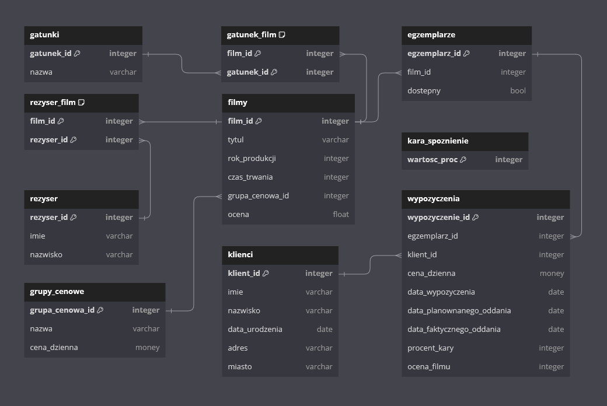
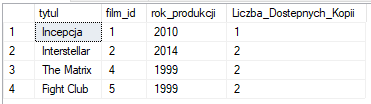
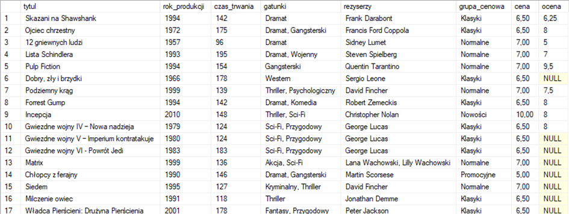
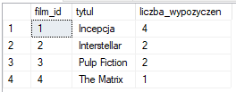
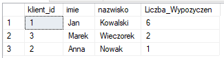
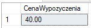
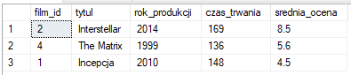

# Temat: Wypożyczalnia filmów.
## 1.	Zakres i krótki opis systemu
1. **Cel projektu:** Celem projektu jest stworzenie kompleksowej bazy danych wspierającej działanie fizycznej wypożyczalni filmów. System ma umożliwić zarządzanie dostępnym asortymentem filmów, klientami, wypożyczeniami oraz magazynem.
2. **Opis systemu:** System bazy danych dla wypożyczalni filmów będzie składał się z kilku głównych modułów:
   * **Katalog Filmów:** Ten moduł będzie przechowywał informacje o dostępnych filmach, takie jak tytuł, gatunek, rok produkcji, język, reżyser oraz dostępność.
   * **Rejestr klientów:** Będzie to moduł, który będzie zawierał dane o klientach wypożyczalni, takie jak imię, nazwisko, adres, numer telefonu, oraz historię wypożyczeń.
   * **Rejestr wypożyczeń:** Ten moduł będzie odpowiedzialny za śledzenie wypożyczeń filmów przez klientów. Będzie przechowywał informacje takie jak data wypożyczenia, data zwrotu, koszt wypożyczenia oraz ewentualne opóźnienia w zwrocie.
   * **Stan magazynu:** Moduł ten będzie kontrolować stan magazynowy filmów, rejestrując ilość dostępnych kopii każdego tytułu oraz informacje o nowych dostawach filmów.
   * **Generowanie raportów:** System będzie posiadał możliwość generowania różnego rodzaju raportów, takich jak raporty finansowe, raporty dotyczące popularności poszczególnych filmów czy też raporty dotyczące aktywności klientów.
   * **Ocenianie filmów:** Moduł, w którym przechowywane będą oceny wystawiane przez klientów przy oddawaniu wypożyczonych filmów.
## 2.	Wymagania i funkcje systemu
1. **Zarzadzanie danymi filmów**
   * Dodawanie nowych filmów
   * Usuwanie filmów z bazy
   * Edytowanie danych filmu
2. **Zarządzanie klientami**
   * Rejestracja nowych klientów
   * Usuwanie klientów z bazy
   * Edytowanie danych klientów
3. **Zarządzanie wypożyczeniami**
   * Wypożyczenie filmu klientowi
   * Śledzenie ilości wypożyczeń danego tytułu
   * Zwrot filmu przez klienta
   * Naliczanie dodatkowych opłat za spóźnione oddanie filmu
4. **Zarządzanie stanem magazynu**
   * Sprawdzenie dostępności filmów
   * Zmiana ilości dostępnego tytułu
## 3. Projekt bazy danych
### Schemat bazy danych


### Opis poszczególnych tabel
#### Nazwa tabeli: **filmy**
| Nazwa atrybutu  | Typ      | Opis/Uwagi   |
|-----------------|----------|--------------|
| film_id         | integer  | klucz główny |
| tytul           | varchar  |              |
| rok_produkcji   | integer  |              |
| czas_trwania    | integer  | w minutach   |
| grupa_cenowa_id | integer  | klucz obcy   |
| ocena           | float    | ocena ogólna filmu na podstawie cząstkowych ocen wypożyczeń  |
#### Nazwa tabeli: **gatunki**
| Nazwa atrybutu  | Typ      | Opis/Uwagi   |
|-----------------|----------|--------------|
| gatunek_id      | integer  | klucz główny |
| nazwa           | varchar  |              |
#### Nazwa tabeli: **gatunek_film**
| Nazwa atrybutu  | Typ      | Opis/Uwagi   |
|-----------------|----------|--------------|
| film_id         | integer  | klucz główny (tabela łącznikowa) |
| gatunek_id      | integer  | klucz główny (tabela łącznikowa) |
#### Nazwa tabeli: **rezyser**
| Nazwa atrybutu  | Typ      | Opis/Uwagi   |
|-----------------|----------|--------------|
| rezyser_id      | integer  | klucz główny |
| imie            | varchar  |              |
| nazwisko        | varchar  |              |
#### Nazwa tabeli: **rezyser_film**
| Nazwa atrybutu  | Typ      | Opis/Uwagi   |
|-----------------|----------|--------------|
| film_id         | integer  | klucz główny (tabela łącznikowa) |
| rezyser_id      | integer  | klucz główny (tabela łącznikowa) |
#### Nazwa tabeli: **klienci**
| Nazwa atrybutu  | Typ      | Opis/Uwagi   |
|-----------------|----------|--------------|
| klient_id       | integer  | klucz główny |
| imie            | varchar  |              |
| nazwisko        | varchar  |              |
| data_urodzenia  | date     |              |
| adres           | varchar  |              |
| miasto          | varchar  |              |
#### Nazwa tabeli: **wypozyczenia**
| Nazwa atrybutu  | Typ      | Opis/Uwagi   |
|-----------------|----------|--------------|
| wypozyczenie_id | integer  | klucz główny |
| egzemplarz_id   | integer  | klucz obcy   |
| klient_id       | integer  | klucz obcy   |
| cena_dzienna    | money    |              |
| data_wypozyczenia | date   |              |
| data_planowanego_oddania | date |         |
| data_faktycznego_oddania | date |         |
| procent_kary    | integer  | Liczba procent ceny w przypadku oddania po terminie. Wartość jest brana z kara_spoznienie, lub pozostaje pusta. |
| ocena_filmu     | integer  |              |
#### Nazwa tabeli: **egzemplarze**
| Nazwa atrybutu  | Typ      | Opis/Uwagi   |
|-----------------|----------|--------------|
| egzemplarz_id   | integer  | klucz główny |
| film_id         | integer  | klucz obcy   |
| dostepny        | bool     |              |
#### Nazwa tabeli: **grupy_cenowe**
| Nazwa atrybutu  | Typ      | Opis/Uwagi   |
|-----------------|----------|--------------|
| grupa_cenowa_id | integer  | klucz główny |
| nazwa           | varchar  |              |
| cena_dzienna    | money    |              |
#### Nazwa tabeli: **kara_spoznienie**
| Nazwa atrybutu  | Typ      | Opis/Uwagi   |
|-----------------|----------|--------------|
| wartosc_proc    | integer  | klucz główny, liczba procent zwykłej ceny, np. 150 jako 150% podstawowej ceny |
## 4. Implementacja
### Kod poleceń DDL
```sql
CREATE TABLE grupy_cenowe ( 
    grupa_cenowa_id INT IDENTITY(1,1) PRIMARY KEY, 
    nazwa VARCHAR(50) NOT NULL, 
    cena_dzienna MONEY NOT NULL
); 
 
CREATE TABLE filmy ( 
    film_id INT IDENTITY(1,1) PRIMARY KEY, 
    tytul VARCHAR(200) NOT NULL, 
    rok_produkcji INT NOT NULL, 
    czas_trwania INT NOT NULL, 
    grupa_cenowa_id INT NOT NULL, 
    ocena FLOAT, 
    FOREIGN KEY (grupa_cenowa_id) REFERENCES grupy_cenowe(grupa_cenowa_id) 
); 
 
CREATE TABLE rezyser ( 
    rezyser_id INT IDENTITY(1,1) PRIMARY KEY, 
    imie VARCHAR(50) NOT NULL, 
    nazwisko VARCHAR(100) NOT NULL 
); 
 
CREATE TABLE rezyser_film ( 
    film_id INT, 
    rezyser_id INT, 
    PRIMARY KEY (film_id, rezyser_id), 
    FOREIGN KEY (film_id) REFERENCES filmy(film_id), 
    FOREIGN KEY (rezyser_id) REFERENCES rezyser(rezyser_id) 
); 
 
CREATE TABLE gatunki ( 
    gatunek_id INT IDENTITY(1,1) PRIMARY KEY, 
    nazwa VARCHAR(50) NOT NULL 
); 
 
CREATE TABLE gatunek_film ( 
    film_id INT, 
    gatunek_id INT, 
    PRIMARY KEY (film_id, gatunek_id), 
    FOREIGN KEY (film_id) REFERENCES filmy(film_id), 
    FOREIGN KEY (gatunek_id) REFERENCES gatunki(gatunek_id) 
); 
 
CREATE TABLE klienci ( 
    klient_id INT IDENTITY(1,1) PRIMARY KEY, 
    imie VARCHAR(50) NOT NULL, 
    nazwisko VARCHAR(100) NOT NULL, 
    data_urodzenia DATE NOT NULL, 
    adres VARCHAR(100) NOT NULL, 
    miasto VARCHAR(50) NOT NULL 
); 
 
CREATE TABLE egzemplarze ( 
    egzemplarz_id INT IDENTITY(1,1) PRIMARY KEY, 
    film_id INT NOT NULL, 
    dostepny BIT NOT NULL, 
    FOREIGN KEY (film_id) REFERENCES filmy(film_id) 
); 

CREATE TABLE kara_spoznienie ( 
    wartosc_proc INT PRIMARY KEY 
); 
 
CREATE TABLE wypozyczenia ( 
    wypozyczenie_id INT IDENTITY(1,1) PRIMARY KEY, 
    egzemplarz_id INT NOT NULL, 
    klient_id INT NOT NULL, 
    cena_dzienna MONEY NOT NULL, 
    data_wypozyczenia DATE NOT NULL, 
    data_planowanego_oddania DATE NOT NULL, 
    data_faktycznego_oddania DATE, 
    procent_kary INT, 
    ocena_filmu INT, 
    FOREIGN KEY (egzemplarz_id) REFERENCES egzemplarze(egzemplarz_id), 
    FOREIGN KEY (klient_id) REFERENCES klienci(klient_id) 
);
```
### Widoki

---
1. Widok dostępnych filmów
---
```sql
CREATE VIEW vw_dostepne_filmy AS
SELECT
    f.tytul,
    f.film_id,
    f.rok_produkcji,
    COUNT(e.egzemplarz_id) AS Liczba_Dostepnych_Kopii
FROM
    filmy f
JOIN
    egzemplarze e 
    ON f.film_id = e.film_id
WHERE 
    dostepny = 1
GROUP BY
    f.film_id,
    f.tytul,
    f.rok_produkcji;
```


---
2. Widok informacje o filmach
---
```sql
CREATE VIEW vw_info_filmy AS 
SELECT  
    f.tytul, 
    f.rok_produkcji, 
    f.czas_trwania, 
    dbo.GetGatunki(f.film_id) AS gatunki, 
    dbo.GetRezyserzy(f.film_id) AS rezyserzy, 
    gc.nazwa AS grupa_cenowa, 
    gc.cena_dzienna AS cena, 
    f.ocena 
FROM  
    filmy f 
JOIN  
    grupy_cenowe AS gc 
ON  
    f.grupa_cenowa_id = gc.grupa_cenowa_id;
```

### Procedury składowane

---
1. Procedura wyświetlająca liczbę wypożyczeń filmów z podanego okresu
---
```sql
CREATE PROCEDURE sp_liczba_wypozyczen_filmow_okres
    @FromDate DATE,
    @ToDate DATE
AS
BEGIN
    SELECT 
        f.film_id,
        f.tytul,
        COUNT(w.wypozyczenie_id) AS liczba_wypozyczen
    FROM 
        filmy f
    JOIN 
        egzemplarze e 
        ON f.film_id = e.film_id
    JOIN 
        wypozyczenia w 
        ON e.egzemplarz_id = w.egzemplarz_id
    WHERE 
        w.data_wypozyczenia BETWEEN @FromDate AND @ToDate
    GROUP BY
        f.film_id,
	  f.tytul;
END;
```


---
2. Procedura dodająca nowe wypożyczenie
---
```sql
CREATE PROCEDURE sp_dodaj_wypozyczenie
    @egzemplarz_id INT,
    @klient_id INT,
    @data_wypozyczenia DATE,
    @data_planowanego_oddania DATE,
    @data_faktycznego_oddania DATE = NULL,
    @ocena_filmu INT = NULL
AS
BEGIN
    DECLARE @film_id INT;
    DECLARE @cena_dzienna MONEY;
    DECLARE @procent_kary INT;

    SELECT @film_id = film_id
    FROM egzemplarze
    WHERE egzemplarz_id = @egzemplarz_id;

    SELECT @cena_dzienna = gc.cena_dzienna
    FROM filmy f
    JOIN grupy_cenowe gc ON f.grupa_cenowa_id = gc.grupa_cenowa_id
    WHERE f.film_id = @film_id;

    SELECT @procent_kary = wartosc_proc FROM kara_spoznienie;

    INSERT INTO wypozyczenia (
        egzemplarz_id,
        klient_id,
        cena_dzienna,
        data_wypozyczenia,
        data_planowanego_oddania,
        data_faktycznego_oddania,
        procent_kary,
        ocena_filmu
    )
    VALUES (
        @egzemplarz_id,
        @klient_id,
        @cena_dzienna,
        @data_wypozyczenia,
        @data_planowanego_oddania,
        @data_faktycznego_oddania,
        @procent_kary,
        @ocena_filmu
    );
END;
```

---
3. Procedura zwracania wypożyczenia
---
```sql
CREATE PROCEDURE sp_zwroc_wypozyczenie
    @wypozyczenie_id INT,
    @data_faktycznego_oddania DATE = NULL,
    @ocena INT = NULL
AS
BEGIN
    SET @data_faktycznego_oddania = ISNULL(@data_faktycznego_oddania, GETDATE())

    IF NOT EXISTS (SELECT 1 FROM wypozyczenia WHERE wypozyczenie_id = @wypozyczenie_id)
    BEGIN
        SELECT 'Wypożyczenie o podanym ID nie istnieje!' AS Blad;
        RETURN;
    END

    IF EXISTS (SELECT 1 FROM wypozyczenia WHERE wypozyczenie_id = @wypozyczenie_id AND data_faktycznego_oddania IS NOT NULL)
    BEGIN
        SELECT 'Film został już zwrócony!' AS Blad;
        RETURN;
    END

    IF @data_faktycznego_oddania >= (SELECT data_wypozyczenia FROM wypozyczenia WHERE wypozyczenie_id = @wypozyczenie_id) AND
       (@ocena IS NULL OR @ocena >= 0)
    BEGIN
        UPDATE wypozyczenia
        SET 
            data_faktycznego_oddania = @data_faktycznego_oddania,
            ocena_filmu = @ocena
        WHERE wypozyczenie_id = @wypozyczenie_id;

        UPDATE egzemplarze
        SET dostepny = 1
        WHERE egzemplarz_id = (
            SELECT egzemplarz_id 
            FROM wypozyczenia 
            WHERE wypozyczenie_id = @wypozyczenie_id);
    END
    ELSE
    BEGIN
        SELECT 'Wprowadzono niepoprawne dane!' AS Blad;
    END
END;
```

---
4. Procedura ustawiania kary za spóźnienie
---
```sql
CREATE PROCEDURE sp_ustaw_kare_za_spoznienie
    @nowa_wartosc INT
AS
BEGIN
    IF @nowa_wartosc >= 100
		BEGIN
			UPDATE dbo.kara_spoznienie
			SET wartosc_proc = @nowa_wartosc;
		END
    ELSE
        BEGIN
            SELECT 'Wprowadzono niepoprawne dane!' AS Blad;
        END
END;
```
### Triggery

---
1. Trigger ustawiający dostępność na 0 przy dodaniu wypożyczenia egzemplarza
---
```sql
CREATE TRIGGER trg_ustaw_dostepnosc_po_wypozyczeniu
ON wypozyczenia
AFTER INSERT
AS
BEGIN
    UPDATE egzemplarze
    SET dostepny = 0
    WHERE egzemplarz_id IN (SELECT egzemplarz_id FROM inserted);
END;
```

---
2. Trigger służący do aktualizacji średniej oceny danego filmu po dodaniu lub modyfikacji wypożyczenia.
---
```sql
CREATE TRIGGER trg_aktualizuj_srednia_ocene_filmu
ON wypozyczenia
AFTER INSERT, UPDATE
AS
BEGIN
   
    DECLARE @film_id INT;
    DECLARE @srednia_ocena FLOAT;

   
    IF EXISTS (SELECT * FROM inserted WHERE ocena_filmu IS NOT NULL)
    BEGIN
        SELECT @film_id = e.film_id
        FROM inserted i
        JOIN egzemplarze e ON i.egzemplarz_id = e.egzemplarz_id;

        SELECT @srednia_ocena = AVG(CAST(ocena_filmu AS FLOAT))
        FROM wypozyczenia w
        JOIN egzemplarze e ON w.egzemplarz_id = e.egzemplarz_id
        WHERE e.film_id = @film_id AND w.ocena_filmu IS NOT NULL;

        UPDATE filmy
        SET ocena = @srednia_ocena
        WHERE film_id = @film_id;
    END
END;
```
### Funkcje

---
1. Funkcja zwracająca nazwę wszystkich gatunków oddzielonych przecinkiem dla podanego filmID.
---
```sql
CREATE FUNCTION GetGatunki(@FilmID INT) 
RETURNS NVARCHAR(MAX) 
AS 
BEGIN 
    DECLARE @Gatunki NVARCHAR(MAX) 
    SET @Gatunki = '' 
 
    SELECT @Gatunki = @Gatunki + g.nazwa + ', ' 
    FROM gatunki g 
    JOIN gatunek_film gf ON g.gatunek_id = gf.gatunek_id 
    WHERE gf.film_id = @FilmID 
 
    -- Usuwanie przecinka z konca 
    IF LEN(@Gatunki) > 0 
        SET @Gatunki = LEFT(@Gatunki, LEN(@Gatunki) - 1) 
    RETURN @Gatunki 
END;
```

---
2. Funkcja zwracająca imię i nazwisko wszystkich reżyserów oddzielonych przecinkiem dla podanego filmID.
---
```sql
CREATE FUNCTION GetRezyserzy(@FilmID INT) 
RETURNS NVARCHAR(MAX) 
AS 
BEGIN 
    DECLARE @Rezyserzy NVARCHAR(MAX) 
    SET @Rezyserzy = '' 
 
    SELECT @Rezyserzy = @Rezyserzy + r.imie + ' ' + r.nazwisko + ', ' 
    FROM rezyser r 
    JOIN rezyser_film rf ON r.rezyser_id = rf.rezyser_id 
    WHERE rf.film_id = @FilmID 
 
    -- Usuwanie przecinka z konca 
    IF LEN(@Rezyserzy) > 0 
        SET @Rezyserzy = LEFT(@Rezyserzy, LEN(@Rezyserzy) - 1) 
 
    RETURN @Rezyserzy 
END;
```

---
3. Funkcja zwracająca najaktywniejszych klientów z podanego okresu czasu.
---
```sql
CREATE FUNCTION GetMostActiveCustomers(@FromDate DATE, @ToDate DATE)
RETURNS TABLE
AS
RETURN
( 
    SELECT TOP 10
        k.klient_id,
        k.imie, 
        k.nazwisko, 
        COUNT(w.wypozyczenie_id) AS Liczba_Wypozyczen
    FROM 
        klienci k
    JOIN 
        wypozyczenia w ON k.klient_id = w.klient_id
    WHERE 
        w.data_wypozyczenia BETWEEN @FromDate AND @ToDate
    GROUP BY 
        k.klient_id, k.imie, k.nazwisko
    ORDER BY
        Liczba_Wypozyczen DESC
);
```


---
4. Funkcja obliczająca cene wypożyczenia.
---
```sql
CREATE FUNCTION dbo.CalculateRentalPrice(@wypozyczenie_id INT)
RETURNS MONEY
AS
BEGIN
    DECLARE @data_wypozyczenia DATE;
    DECLARE @data_planowanego_oddania DATE;
    DECLARE @data_faktycznego_oddania DATE;
    DECLARE @cena_dzienna MONEY;
    DECLARE @procent_kary INT;
    DECLARE @liczba_dni_wypozyczenia INT;
    DECLARE @liczba_dni_spoznienia INT;
    DECLARE @cena_wypozyczenia MONEY;
    DECLARE @cena_kary MONEY;

    SELECT
        @data_wypozyczenia = w.data_wypozyczenia,
        @data_planowanego_oddania = w.data_planowanego_oddania,
        @data_faktycznego_oddania = w.data_faktycznego_oddania, 
        @cena_dzienna = w.cena_dzienna, 
        @procent_kary = w.procent_kary
    FROM 
        wypozyczenia w
    WHERE 
        w.wypozyczenie_id = @wypozyczenie_id;

    IF @data_faktycznego_oddania IS NOT NULL AND @data_faktycznego_oddania <= @data_planowanego_oddania
    BEGIN
        SET @liczba_dni_wypozyczenia = DATEDIFF(DAY, @data_wypozyczenia, @data_faktycznego_oddania) + 1;
        SET @liczba_dni_spoznienia = 0; 
    END
    ELSE
    BEGIN
        SET @liczba_dni_wypozyczenia = DATEDIFF(DAY, @data_wypozyczenia, @data_planowanego_oddania) + 1;

        SET @liczba_dni_spoznienia = CASE
            WHEN @data_faktycznego_oddania > @data_planowanego_oddania THEN DATEDIFF(DAY, @data_planowanego_oddania, @data_faktycznego_oddania)
            ELSE 0
        END;
    END;

    SET @cena_wypozyczenia = @liczba_dni_wypozyczenia * @cena_dzienna;

    SET @cena_kary = @liczba_dni_spoznienia * @cena_dzienna * @procent_kary / 100.0;

    SET @cena_wypozyczenia = @cena_wypozyczenia + @cena_kary;

    RETURN @cena_wypozyczenia;
END;
```


---
5. Funkcja wyświetlająca najlepiej oceniane filmy w podanym okresie czasu
---
```sql
CREATE FUNCTION TopRatedMoviesInPeriod (
    @fromDate DATE,
    @toDate DATE
)
RETURNS TABLE
AS
RETURN
(
    SELECT TOP 3 
        f.film_id,
        f.tytul,
        f.rok_produkcji,
        f.czas_trwania,
        ROUND(AVG(CAST(w.ocena_filmu AS FLOAT)), 1) AS srednia_ocena
    FROM wypozyczenia w
    INNER JOIN egzemplarze e ON w.egzemplarz_id = e.egzemplarz_id
    INNER JOIN filmy f ON e.film_id = f.film_id
    WHERE w.data_wypozyczenia BETWEEN @fromDate AND @toDate
      AND w.ocena_filmu IS NOT NULL
    GROUP BY f.film_id, f.tytul, f.rok_produkcji, f.czas_trwania
    ORDER BY AVG(CAST(w.ocena_filmu AS FLOAT)) DESC
);
```


---
6. Funkcja wyświetlająca najczęściej oglądane filmy w podanym okresie czasu
---
```sql
CREATE FUNCTION BestsellerInPeriod (
    @fromDate DATE,
    @toDate DATE
)
RETURNS TABLE
AS
RETURN
(
    SELECT TOP 3 
        f.film_id,
        f.tytul,
        f.rok_produkcji,
        f.czas_trwania,
        COUNT(wypozyczenie_id) AS liczba_wypozyczen
    FROM wypozyczenia w
    INNER JOIN egzemplarze e ON w.egzemplarz_id = e.egzemplarz_id
    INNER JOIN filmy f ON e.film_id = f.film_id
    WHERE w.data_wypozyczenia BETWEEN @fromDate AND @toDate
    GROUP BY f.film_id, f.tytul, f.rok_produkcji, f.czas_trwania
    ORDER BY liczba_wypozyczen DESC
);
```

